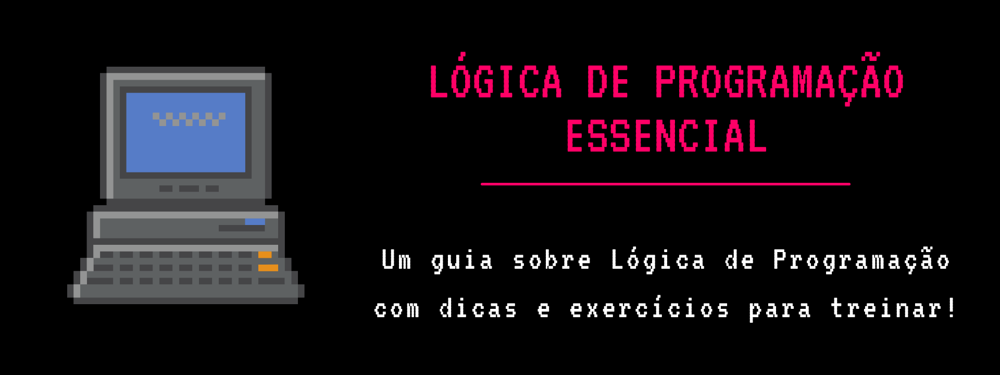

# Lógica de programação

A palavra **lógica** está relacionada com uma maneira específica de raciocinar, que visa a determinação do que é verdadeiro ou não.

Então, a **lógica de programação** é um maneira específica de raciocinar, para construir a melhor sequencia de ações para solucionar problemas.

*"Programar é resolver um problema!"*

### Índice

* <a href="#algoritmos">1 - Algoritmos</a>
* <a href="#variaveis">2 - Variáveis</a>
* [3 - Portugol](#3---portugol)


**Algoritmo**, de uma forma geral podemos dizer que é uma sequencia finita de passos para resolver um problema. A gente pode até não perceber mas eles estão presentes em nosso dia a dia, como tomar café ou atravessar a rua, uma receita de bolo ou manual de equipamentos.

**Exemplo de algoritmo simples:**
```
algoritmo "Tomar café"
inicio 
partir o pão 
passar manteiga no pão 
pegar a xícara 
colocar café na xícara 
sentar na cadeira 
comer o pão 
beber o café 
fimalgoritmo
```
Mas para programar, desenvolvemos **Algoritmos Computacionais** que são passos a serem seguindos por um módulo processador e seus respectivos usuários que, quando executados na ordem correta, conseguem realizar determinada tarefa.

Para a contrução de algoritmos computacionais podemos seguir os seguintes passos:
* compreenção do problema
* definição dados de entrada e saída
* definir processamento
* utilizar um método de construção
* teste e diagnóstico

**Exemplo de algoritmo computacional em Javascript:**
```
<!DOCTYPE html>
<html lang="pt-br">
<head>  
  <meta charset="UTF-8">
  <title>Exemplo de "Olá, Mundo!" em Javascript</title>
  <script>
   alert ('Olá, Mundo!');
  </script>
</head>
<body>
</body>
</html>
```

### Fica a Dica:
No site abaixo você pode treinar sua lógica e desenvolver algotimos em jogos!<br>
https://code.org/hourofcode/overview


Uma variável é um espaço na memória do computador destinado ao armazenamento de dados que é alterado durante a execução do algoritmo.

## Identificadores, renomeando as variáveis

1. deve começar com uma letra
2. os próximos podem ser letras ou números 
3. não pode utilizar nenhum símbolo. Exceto _
4. não pode conter espaços em branco
5. não pode conter letras com acento
6. não pode ser uma palavra reservada

## Tipos Primitivos

* **Inteiro:** 1, 3, -5, 198, 0
* **Real:** 0.5, 5.0, 9.8, -77.3, 3.1415
* **Caractere:** "Patrícia" "algoritmo" "123"
* **Lógico:** verdadeiro falso

## Declaração de variáveis 
```
Var
Identificador: tipo
```
**Exemplo:** <br>
idade: inteiro

## Atribuições em variáveis
```
Identificador <- valor
```
**Exemplo:** <br>
idade <- 24
